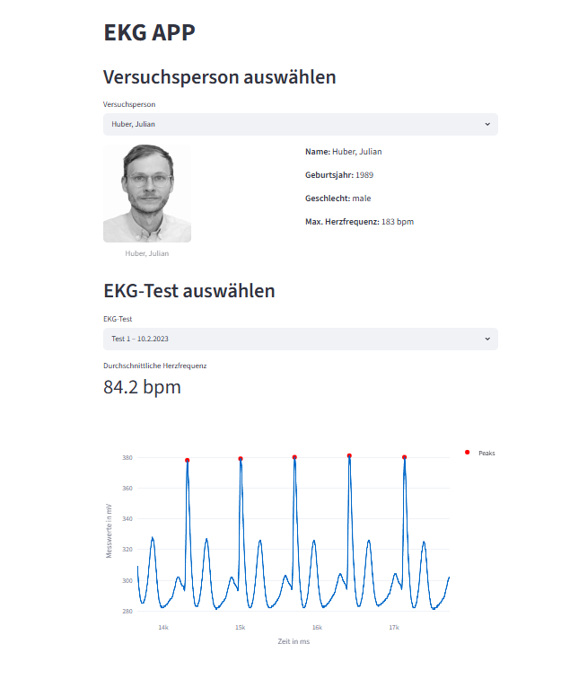

# Objektorientierung

Dieses Modul dient der medizintechnischen Analyse von EKG-Daten und der Verwaltung von Versuchspersonen-Stammdaten. Es berechnet das Alter, die geschlechtsspezifische maximale Herzfrequenz und detektiert die R-Zacken des Herzens über einen Peak-Finder-Algorithmus, um die aktuelle Herzfrequenz zu ermitteln.

## Verwendete Bibliotheken
* pandas
* streamlit
* plotly
* pillow

## Bibliotheken herunterladen und installieren:
pip install -r requirements.txt

## streamlit starten
streamlit run main.py

## Streamlit-Vorschau

